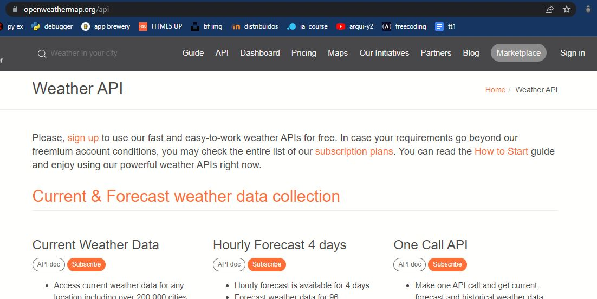
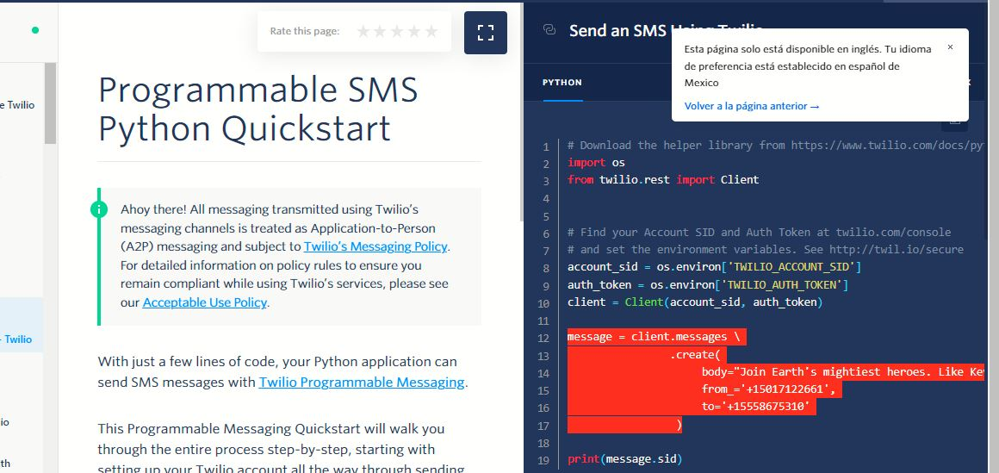
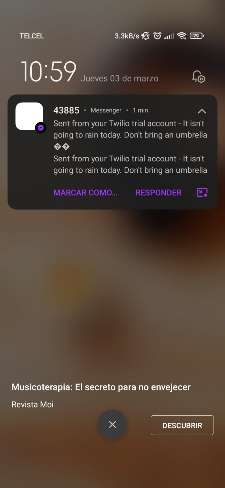

# Rain Alert! haciendo uso de la  API Weather Map

Uso de la api weather map para saber como estará el clima en mi ciudad el día de hoy.

Obtenemos el clima de las primeras 12 horas del día, y comparamos los códigos del clima con la documentación de la API Weather Map

Despues con ayuda de la API Twilio y su documentación deberemos ser capaces de enviarnos mensajes a nosotros mismos o al numero de confianza configurado

Finalmente podemos ver el resultado reflejado en nuestro celular.

